# CustomerAffinity — Real-Time Product Personalisation Engine

> A real-time, event-driven customer product affinity scoring system.
> Uses Gradient Boosting (XGBoost) to predict how likely a customer is to
> engage with a specific product, enabling downstream personalisation across
> digital retail touchpoints.

---

## Architecture Overview

```mermaid
flowchart TD
    EV["Customer Activity Event&#10;(API Gateway / SQS)"]
    LH["Lambda Handler&#10;lambda/handler.py"]
    AFF["Customer Affinity&#10;SageMaker Endpoint"]
    DB[("PostgreSQL&#10;Affinity Scores DB")]

    EV -->|triggers| LH
    LH -->|invoke| AFF
    AFF -->|return affinity score| LH
    LH -->|store score| DB

    style EV  fill:#4f46e5,color:#fff,stroke:#312e81
    style LH  fill:#0ea5e9,color:#fff,stroke:#0369a1
    style AFF fill:#8b5cf6,color:#fff,stroke:#5b21b6
    style DB  fill:#1e293b,color:#94a3b8,stroke:#334155
```



---

## Repository Structure

```
customer-affinity-engine/
├── personalization-model/   XGBoost ML model (SageMaker + Docker)
├── lambda/                  Event-driven Lambda for real-time scoring
└── README.md
```

---

## Components

### 1. `personalization-model/`

An **XGBoost Gradient Boosting** model that predicts a continuous affinity
score (0–1) representing the probability a customer will engage with a
specific product, given their behavioral history and segment attributes.

#### Algorithm: XGBoost (Gradient Boosted Trees)

```
CUSTOMER ACTIVITY DATA
        │
        ▼
┌─────────────────────┐
│ Feature Engineering │  Recency bucketing, engagement score,
│ & Preprocessing     │  value tier, StandardScaler normalisation
└─────────┬───────────┘
          │
          ▼
┌─────────────────────┐
│  XGBoost Regressor  │  300 estimators, max_depth=6,
│  (Gradient Boost)   │  learning_rate=0.05, subsample=0.8
└─────────┬───────────┘
          │
          ▼
┌─────────────────────┐
│  Affinity Scoring   │  Output: Affinity_Score [0-1]
│  & Confidence Band  │  + Confidence: HIGH/MEDIUM/LOW
└─────────────────────┘
```

**Why XGBoost?**
Customer affinity prediction depends on heterogeneous tabular features
(behavioral metrics, demographic segments, product attributes) that vary
in scale and type. XGBoost handles this naturally with built-in feature
importance, regularisation, and strong performance on structured data without
requiring extensive feature normalisation.

**Configurable hyperparameters** (via `.env` or `model_config.py`):

| Parameter | Default | Description |
|---|---|---|
| `n_estimators` | `300` | Number of boosting rounds |
| `max_depth` | `6` | Maximum tree depth |
| `learning_rate` | `0.05` | Shrinkage per round |
| `subsample` | `0.8` | Row sampling fraction per round |
| `colsample_bytree` | `0.8` | Feature sampling fraction per tree |

**Model Input Parameters (13 features):**

| Parameter | Type | Description |
|---|---|---|
| `Customer_Segment` | `string` | Customer tier (PREMIUM / STANDARD / BUDGET) |
| `Age_Group` | `string` | Customer age band (18-24, 25-34, 35-44, 45+) |
| `Location_Region` | `string` | Geographic region code |
| `Device_Type` | `string` | Device used (MOBILE / DESKTOP / TABLET) |
| `Product_Category` | `string` | Top-level product category |
| `Product_Sub_Category` | `string` | Sub-level category |
| `Brand` | `string` | Product brand |
| `Purchase_Frequency` | `float` | Purchases in the last 12 months |
| `Avg_Order_Value` | `float` | Average spend per order |
| `Days_Since_Last_Purchase` | `float` | Recency signal |
| `Browse_Count` | `float` | Product page views in session |
| `Cart_Abandonment_Rate` | `float` | Fraction of carts not converted (0–1) |
| `Session_Duration_Mins` | `float` | Session length in minutes |

**Model Output:**

| Field | Type | Description |
|---|---|---|
| `Affinity_Score` | `float` | Predicted engagement probability (0–1) |
| `Confidence` | `string` | `HIGH` (≥0.70) / `MEDIUM` (0.40–0.70) / `LOW` (<0.40) |

**Pipeline files:**
- `endpoints/training/train.py` — SageMaker training entrypoint
- `endpoints/inference/inference.py` — SageMaker inference handler
- `src/model.py` — `CustomerAffinityModel` fit/predict/save/load
- `src/preprocessing.py` — all feature engineering
- `scripts/evaluate_model.py` — RMSE and confidence distribution
- `scripts/run_local.py` — local dev pipeline runner
- `build_and_push.py` / `deploy_simple.py` — Docker + ECR + endpoint deploy

---

### 2. `lambda/`

Event-driven Lambda function triggered by **customer activity events**
(product page views, cart additions, login) via API Gateway or SQS.

Invokes the customer affinity SageMaker endpoint and stores the resulting
affinity score to PostgreSQL for downstream use by personalisation and
recommendation services.

> **Note:** This Lambda is event-driven, not scheduled. It scores customers
> in real-time as activity occurs — not on a daily batch schedule.

**Expected event payload:**

```json
{
  "customer_events": [
    {
      "customer_id": "CUST001",
      "Customer_Segment": "PREMIUM",
      "Age_Group": "25-34",
      "Location_Region": "NORTH",
      "Device_Type": "MOBILE",
      "Product_Category": "Electronics",
      "Product_Sub_Category": "Laptops",
      "Brand": "BrandX",
      "Purchase_Frequency": 12,
      "Avg_Order_Value": 3500.0,
      "Days_Since_Last_Purchase": 14,
      "Browse_Count": 8,
      "Cart_Abandonment_Rate": 0.2,
      "Session_Duration_Mins": 12.5
    }
  ]
}
```

**Environment variables:**

| Variable | Description |
|---|---|
| `AFFINITY_ENDPOINT_NAME` | SageMaker endpoint name |
| `DATABASE_URL` | PostgreSQL connection string |
| `AWS_REGION` | AWS region |

---

## Prototype API — Request & Response

This section illustrates the expected end-to-end contract when invoking the
Customer Affinity Engine via the Lambda handler (exposed through API Gateway).

### Request

**`POST /score`**

```http
POST /score HTTP/1.1
Host: <api-gateway-url>
Content-Type: application/json
x-api-key: <your-api-key>
```

```json
{
  "customer_events": [
    {
      "customer_id": "CUST-7812",
      "Customer_Segment": "PREMIUM",
      "Age_Group": "25-34",
      "Location_Region": "NORTH",
      "Device_Type": "MOBILE",
      "Product_Category": "Electronics",
      "Product_Sub_Category": "Laptops",
      "Brand": "BrandX",
      "Purchase_Frequency": 12,
      "Avg_Order_Value": 3500.00,
      "Days_Since_Last_Purchase": 14,
      "Browse_Count": 8,
      "Cart_Abandonment_Rate": 0.20,
      "Session_Duration_Mins": 12.5
    },
    {
      "customer_id": "CUST-4390",
      "Customer_Segment": "STANDARD",
      "Age_Group": "35-44",
      "Location_Region": "SOUTH",
      "Device_Type": "DESKTOP",
      "Product_Category": "Apparel",
      "Product_Sub_Category": "Footwear",
      "Brand": "BrandY",
      "Purchase_Frequency": 4,
      "Avg_Order_Value": 850.00,
      "Days_Since_Last_Purchase": 62,
      "Browse_Count": 3,
      "Cart_Abandonment_Rate": 0.55,
      "Session_Duration_Mins": 5.2
    }
  ]
}
```

**Field Constraints:**

| Field | Required | Accepted Values |
|---|---|---|
| `customer_id` | ✅ | Any unique string identifier |
| `Customer_Segment` | ✅ | `PREMIUM` / `STANDARD` / `BUDGET` |
| `Age_Group` | ✅ | `18-24` / `25-34` / `35-44` / `45+` |
| `Location_Region` | ✅ | `NORTH` / `SOUTH` / `EAST` / `WEST` |
| `Device_Type` | ✅ | `MOBILE` / `DESKTOP` / `TABLET` |
| `Purchase_Frequency` | ✅ | Integer ≥ 0 |
| `Avg_Order_Value` | ✅ | Float ≥ 0.0 |
| `Days_Since_Last_Purchase` | ✅ | Float ≥ 0.0 |
| `Browse_Count` | ✅ | Integer ≥ 0 |
| `Cart_Abandonment_Rate` | ✅ | Float in range \[0.0 – 1.0\] |
| `Session_Duration_Mins` | ✅ | Float ≥ 0.0 |

---

### Response

**HTTP 200 — Scored Successfully**

```json
{
  "status": "success",
  "scored_at": "2026-03-31T09:30:00Z",
  "results": [
    {
      "customer_id": "CUST-7812",
      "Product_Category": "Electronics",
      "Product_Sub_Category": "Laptops",
      "Brand": "BrandX",
      "Affinity_Score": 0.87,
      "Confidence": "HIGH",
      "stored": true
    },
    {
      "customer_id": "CUST-4390",
      "Product_Category": "Apparel",
      "Product_Sub_Category": "Footwear",
      "Brand": "BrandY",
      "Affinity_Score": 0.43,
      "Confidence": "MEDIUM",
      "stored": true
    }
  ],
  "total_scored": 2,
  "errors": []
}
```

**Response Fields:**

| Field | Type | Description |
|---|---|---|
| `status` | `string` | `success` or `partial_failure` |
| `scored_at` | `string` | ISO 8601 UTC timestamp of the scoring run |
| `results[].customer_id` | `string` | Echo of the input customer identifier |
| `results[].Affinity_Score` | `float` | Predicted engagement probability (0–1) |
| `results[].Confidence` | `string` | `HIGH` (≥ 0.70) / `MEDIUM` (0.40–0.70) / `LOW` (< 0.40) |
| `results[].stored` | `bool` | Whether the score was persisted to PostgreSQL |
| `total_scored` | `integer` | Count of successfully scored events |
| `errors` | `array` | List of per-record errors (empty on full success) |

**HTTP 400 — Validation Error**

```json
{
  "status": "error",
  "code": "INVALID_PAYLOAD",
  "message": "Field 'Cart_Abandonment_Rate' must be between 0.0 and 1.0.",
  "field": "Cart_Abandonment_Rate",
  "customer_id": "CUST-4390"
}
```

**HTTP 500 — Endpoint / Downstream Failure**

```json
{
  "status": "error",
  "code": "SAGEMAKER_INVOCATION_FAILED",
  "message": "SageMaker endpoint 'affinity-endpoint-prod' returned a non-200 response.",
  "retry_after_seconds": 30
}
```

---

## Quick Start

### Recommendation Engine (local)

```bash
cd personalization-model
cp .env.example .env
pip install -r requirements.txt
python scripts/run_local.py --data path/to/customer_interactions.csv
```

### Docker Build & Push to ECR

```bash
cd personalization-model
cp .env.example .env   # Set ECR_REPO_URI, AWS credentials
python build_and_push.py
```

### Deploy SageMaker Endpoint

```bash
cd personalization-model
python deploy_simple.py
```

### Lambda (local test)

```bash
cd lambda
python -c "
from handler import lambda_handler
print(lambda_handler({'customer_events': []}, None))
"
```

---

## Environment Variables

| Variable | Component | Description |
|---|---|---|
| `DATABASE_URL` | lambda | PostgreSQL connection string |
| `AFFINITY_ENDPOINT_NAME` | lambda, model | SageMaker endpoint name |
| `AWS_ACCESS_KEY_ID` | model | AWS credentials |
| `SAGEMAKER_ROLE_ARN` | model | IAM role for SageMaker |
| `S3_BUCKET_NAME` | model | S3 bucket for data and models |
| `ECR_REPO_URI` | model | ECR repository URI for Docker push |

**Never commit `.env` files. Use `.env.example` as the reference.**

---

## Tech Stack

| Layer | Technology |
|---|---|
| ML Model | Python, XGBoost, scikit-learn, pandas |
| Cloud Pipeline | AWS SageMaker, AWS Lambda, Amazon S3 |
| Trigger | API Gateway / SQS (event-driven) |
| Storage | PostgreSQL |
| Containerisation | Docker, AWS ECR |

---

## License

MIT License. See [LICENSE](LICENSE) for details.
